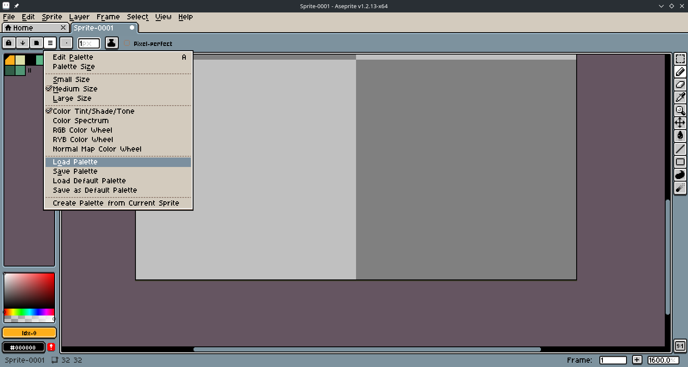
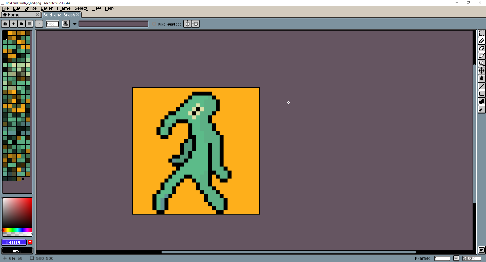
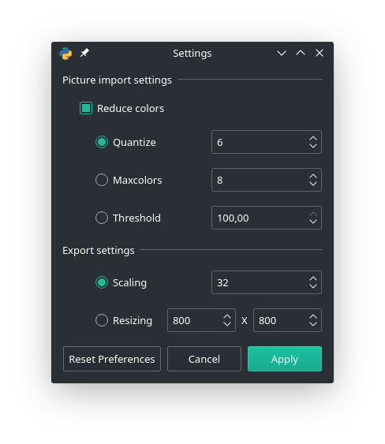
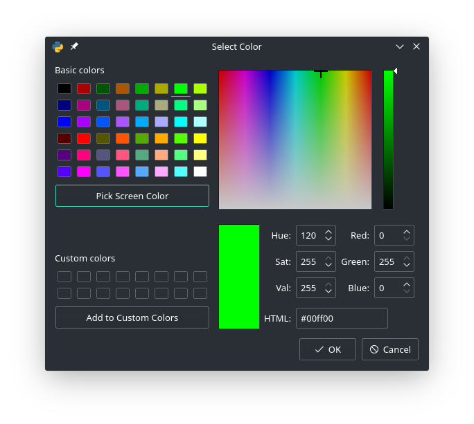

# Pylette

Have you ever had to painstakingly add colors to your palette by hand because the source image has too many colors to be imported in your Editor? The Pylette has come to save your time!

## Usage
Let's take this bold picture as an example.

We can open this masterpiece in the Pylette.

After the picture is opened, the colors are shown in the Pylette where you can edit, add or delete colors. Afterwards you can export your palette.

The resulting palette looks like this:

Now you can import the palette in your image processing program.

## Why use Pylette over built-in palette functionality?
Many image editing programs allow you to import palettes from images but since they don't focus on it they have a few weaknesses. A badly scaled pixelart image has way more colors than meets the eye. The original pixelart has only these 7 colors:

But when import a badly resized picture gets imported into pixeleditor, this happens:

This many colors are suboptimal and you would have to remove most of them and this just takes time. You can simply open the image in Pylette and directly get a good palette.

But this isnt exactly the original palette and you want to edit it. First thing you could try is editing the import settings and resetting the file.

You can also delete, add or edit existing colors.

Here you also have the ability to pick a screen color which can make adding a very specific color way easier.

## Installation

### Windows
Just double-click the pylette.exe.

### Linux
Find the pylette file and double-click it.  
If this doesnt work you have to give the pylette file executable permission.  
You can do this with `chmod +x /path/to/pylette`.
I would also recommend to create a .desktop file so you can open it with an application icon and the ability to start it outside the directory of the executable.
### MacOs
I don't have a Mac; if there is enough demand I may look into options to make an executable.

## Quirks
No program is perfect and the Pylette is a program so it would be better when you know about it quirks.

* Resetting a file not only resets the whole palette and the changed colors in the palette but does so according to the current settings as if you were deleting and adding the file.
* When you add a file, only the current settings are important. So if you want to add multiple pictures with different settings you can do that.
* When you import a picture with alpha channel... your palette won't have said alpha channel.
* When you import a gif only the first frame counts.
* If you have problems with a weird settings window; try to resize it.
* You can change a color in the palette by clicking on the color which opens a colordialog.
* Right-click on a color to delete it.
* If you want to add a color from your screen you must open a colordialog and there you will find an option to pick a color from your screen.
* That the "Custom Color" in the combobox never goes away is neither a bug nor a feature... it's less work.
* The Pylette can only work with rgb and rgb-compatible colorspaces.
* If your palette has a lot of colors and you can open the exported palette then try setting the scaling setting to 1 because your picture may otherwise to big to open.

If you find more quirks or even bugs you are very much encouraged to make an issue on Github.

## FAQ
No Users...  
No Questions!

## Future Features
Probably none because I want(ed) to move on but in case I want to work on it later or you want to contribute there still are things that can to be done.
* Adding proper gif support (so that multiple frames are supported if selected in the settings)
* Adding proper alpha support (which probably won't happen because it would need bigger rewrites in multiple areas)
* Adding more files that can be imported like .css or .gpl
* Adding support for more supported exportable filestypes like .html or .svg files 

The last two are most likely to be added later because they were planned in from the beginning and only later cut out. They are also easy to integrate into the application because of this. If you have other ideas, feel free to share them with me or implement them yourself. 
## For Developers

### Requirements
* Used Python 3.7.2 but should be perfectly compatible down to 3.6. If you want to go lower, you need to replace f-strings with another syntax formatting.  
* Built with PyQt5 5.12.1; PyQt5 5.13.0 and Pyinstaller dont work well with each other.  
* Pillow 6.1.0 but newer version should work.  
* Pyinstaller 3.5 but newer versions should work.  

## Building executables
To create an executable you need to have pyinstaller installed.
1. cd to the directory
2. Run the command `pyinstaller -w -i Example/pylette_256.ico main.py`.
3. Rename the main(.exe) to pylette(.exe) (optional).
4. Copy the config.json and pylette_256.png into the folder with the executable.

## Credits
* Pillow https://github.com/python-pillow/Pillow  
* PyQt5 https://www.riverbankcomputing.com/news  
* Qt (Designer) https://www.qt.io/  
* Python https://www.python.org/  
* Pyinstaller https://www.pyinstaller.org/

## Shown in the pictures
* Manjaro Kde https://manjaro.org/
* Aseprite https://www.aseprite.org/
* Pylette https://github.com/MawOfTheVoid/Pylette
