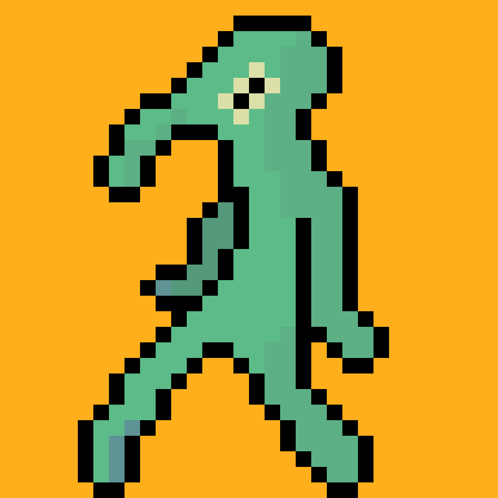
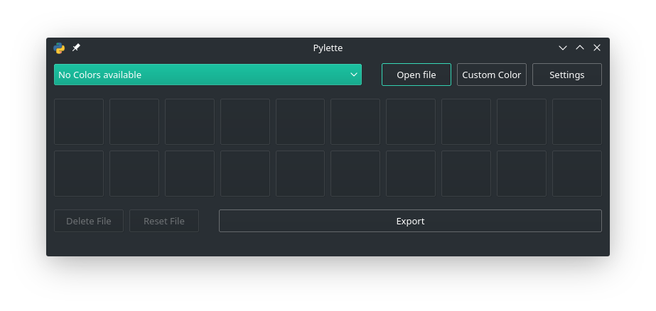
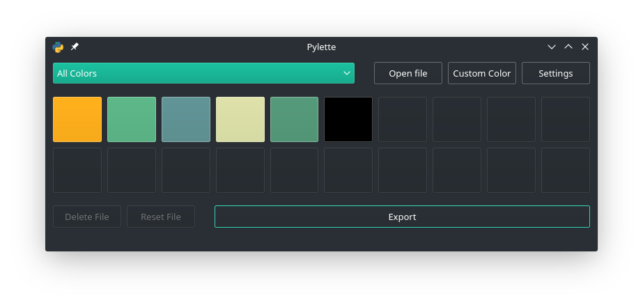

# Pylette

Have you ever had to painstakingly add colors to your palette by hand because the source image has too many colors to be imported in your Editor? The Pylette has come to save your time!

## Usage
Let's take this bold picture as an example.

We can open this masterpiece in the Pylette.

After the picture is opened, the colors are shown in the Pylette where you can edit, add or delete colors. Afterwards you can export your palette.

The resulting palette looks like this:

Of course you can change some parameters in the settings so feel free to try them out.

## Installation

### Windows
Just double-click the pylette.exe.

### Linux
First have to create an executable to know.

### MacOs
I don't have a Mac; if there is enough demand I may look into options to make an executable.

## Should I use the single file executable?
If you dont care about the folder structure around the executable you shouldn't take the single executable because the startup times are higher.

## Quirks
No program is perfect and the Pylette is a program so it would be better when you know about it quirks.

* Resetting a file not only resets the whole palette and the changed colors in the palette but does so according to the current settings as if you were deleting and adding the file.
* When you add a file, only the current settings are important. So if you want to add multiple pictures with different settings you can do that.
* When you import a picture with alpha channel... your palette won't have said alpha channel.
* When you import a gif only the first frame counts.
* If you have problems with a weird settings window; try to resize it.
* You can change a color in the palette by clicking on the color which opens a colordialog.
* Right-click on a color to delete it.
* If you want to add a color from your screen you must open a colordialog and there you will find an option to pick a color from your screen.
* That the "Custom Color" in the combobox never goes away is neither a bug nor a feature... it's less work.
* The Pylette can only work with rgb and rgb-compatible colorspaces

If you find more quirks or even bugs you are very much encouraged to make an issue on Github.

## FAQ
No Users...  
No Questions!

## Future Features
Probably none because I want(ed) to move on but in case I want to work on it later or you want to contribute there still are things that can to be done.
* Adding proper gif support (so that multiple frames are supported if selected in the settings)
* Adding proper alpha support (which probably won't happen because it would need bigger rewrites in multiple areas)
* Adding more files that can be imported like .css or .gpl
* Adding support for more supported exportable filestypes like .html or .svg files 

The last two are most likely to be added later because they were planned in from the beginning and only later cut out. They are also easy to integrate into the application because of this. If you have other ideas, feel free to share them with me or implement them yourself. 
## For Developers

### Requirements
* Used Python 3.7.2 but should be perfectly compatible down to 3.6. If you want to go lower, you need to replace f-strings with another syntax formatting.  
* Built with PyQt5 5.12.1; PyQt5 5.13.0 and Pyinstaller dont work well with each other.  
* Pillow 6.1.0 but newer version should work.  
* Pyinstaller 3.5 but newer versions should work.  

## Building executables
Todo

## Credits
* Pillow https://github.com/python-pillow/Pillow  
* PyQt5 https://www.riverbankcomputing.com/news  
* Qt (Designer) https://www.qt.io/  
* Python https://www.python.org/  
* Pyinstaller https://www.pyinstaller.org/  
